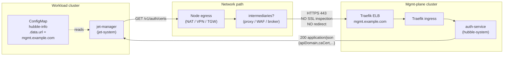
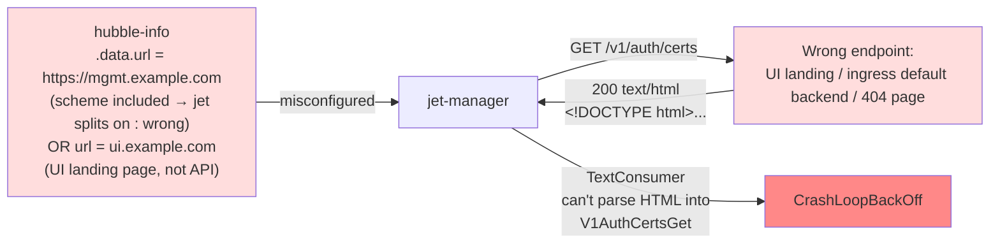
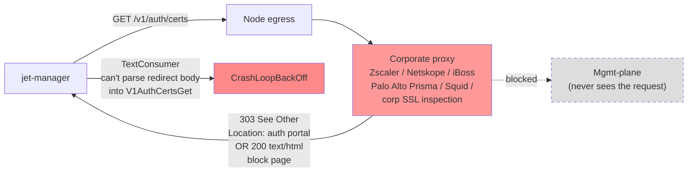
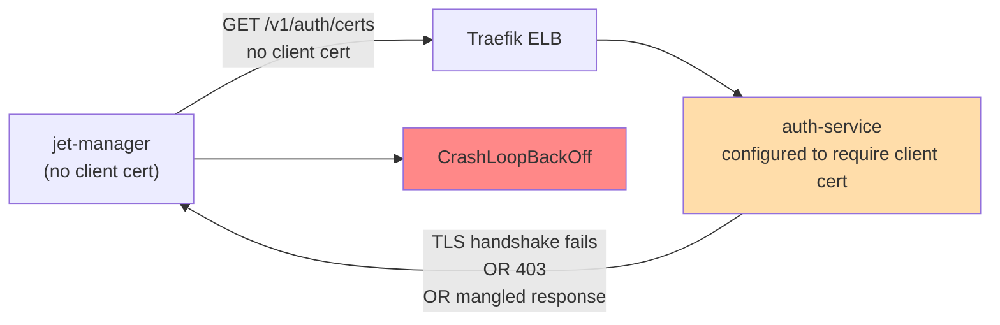
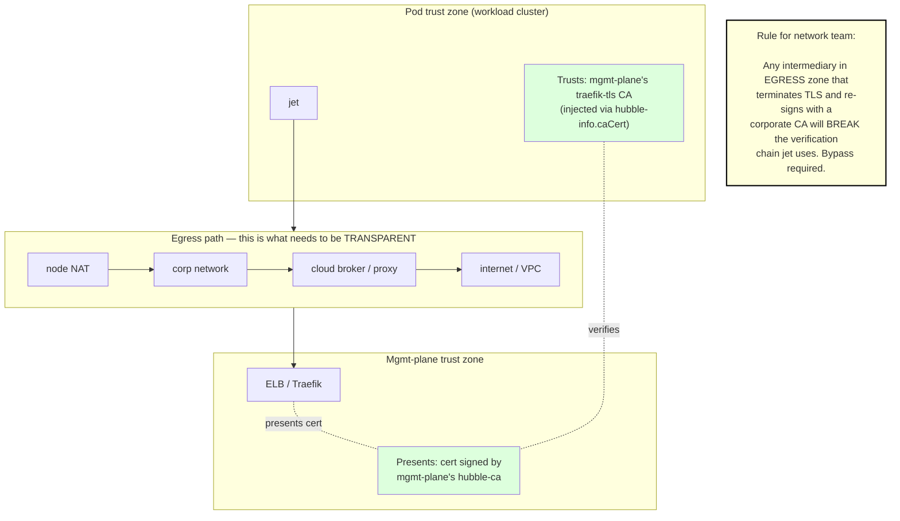

# Connectivity diagram — where the failure modes live

## Working path

## Failure mode 1 — wrong URL in `hubble-info`

Jet points at the wrong hostname or scheme, hits an unrelated endpoint that returns HTML.

**Fix:** correct the `hubble-info` CM. `kubectl -n jet-system edit cm hubble-info`, remove
any scheme, ensure hostname matches the mgmt-plane's Traefik ELB DNS name.

## Failure mode 2 — corporate proxy / cloud broker interception (the important one)

Traffic egresses the workload cluster, hits a corporate proxy or cloud broker in the
enterprise network path, which transparently intercepts HTTPS and returns a redirect,
authentication challenge, or block page.

**Fix:** network team adds a bypass rule — no cluster-side change works. See
[PREFLIGHT-QUESTIONS.md](PREFLIGHT-QUESTIONS.md).

## Failure mode 3 — actual mTLS gate (rare, verify carefully)

Auth-service is configured to require a client cert on `/v1/auth/certs`. Not the case in
shipping VerteX 4.9.18, but hypothesized for some builds.

**Fix:** provision a client cert for jet. See
[../vertex-workload-cluster-provisioning/persistent-fix/](../vertex-workload-cluster-provisioning/persistent-fix/).
**Only apply this if modes 1 and 2 are ruled out.**

## Trust boundaries — what the network team needs to see

The whole thing works only if the TLS chain jet sees at the pod IS the chain the mgmt-plane
served. Any middlebox that "helpfully" decrypts and re-encrypts (SSL inspection, corporate
MITM, cloud broker re-signing) substitutes a different CA into the chain — jet's client
rejects it (or the response body is mangled with a redirect / block page).
